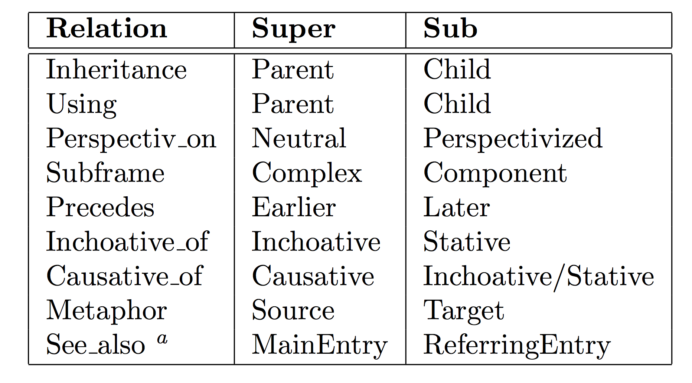
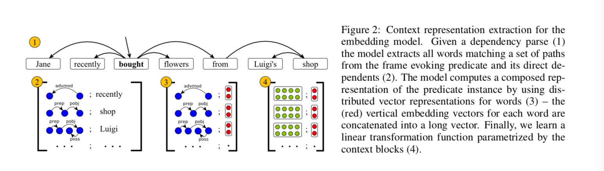
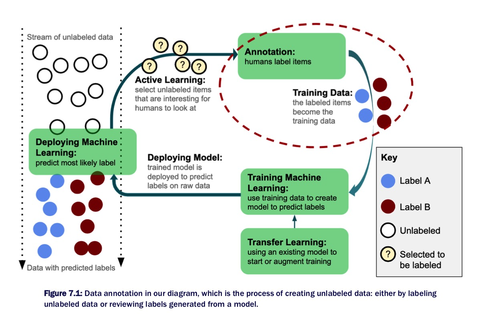
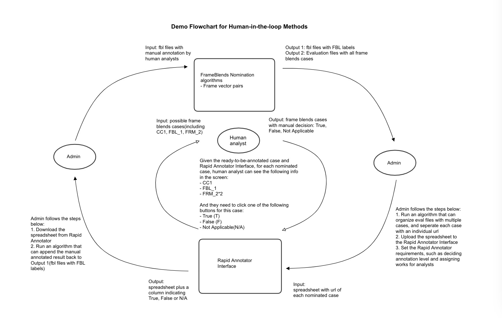

## Welcome to FrameBlends Project 

This project is developed by Wenyue Xi (Suzie) for Google Summer of Code 2020 with Red Hen Lab

### Project Description 
- For the project idea "AI Recognizers of Frame Blends, Especially in Conversations About the Future," my proposal aims to build a semantic tagging system to detect different time frames in the conversation in the form of text or video record. Ideally, this system can classify the situation where human beings imagine a future by blending the present with incompatible frames. The project will be based on some of the existed algorithms, frameworks, and databases, and also choose and integrate them carefully to accomplish the goal. If possible, this project also aims to create an interactive system that allows humans to manually mark the false positive and true negative and keep re-training the data with such manipulation by human experts. In each round of training, the system will consider the manual marks, and eventually reach the stage when the system is able to mark the desired portion as accurate as possible. When the source data is large enough, the tagging system of the blended frame also allows us to make the unnoticed connections between current and past social conditions to gain inspiration to solve the real-world problem, or provide more evidence to the anthropological and historical studies.

## Quick Index of Daily Progress
### Community Bonding Period 
- [Blog Report 1](#blog-report-1) (May 11 ~ May 17) 
- [Blog Report 2](#blog-report-2) (May 18 ~ May 24)
- [Blog Report 3](#blog-report-3) (May 25 ~ May 31)

### Coding Period Before the First Evaluation 
- [Blog Report 4](#blog-report-4) (Jun 1 ~ Jun 7)
- [Blog Report 5](#blog-report-5) (Jun 8 ~ Jun 14)
- [Blog Report 6](#blog-report-6) (Jun 15 ~ Jun 21)
- [Blog Report 7](#blog-report-7) (Jun 22 ~ Jun 28)
- [Blog Report 8](#blog-report-8) (Jun 29 ~ Jul 5)

### Coding Period Before the Second Evaluation
- [Blog Report 9](#blog-report-9) (Jul 6 ~ Jul 12)
- [Blog Report 10](#blog-report-10) (Jul 13 ~ Jul 19)
- [Blog Report 11](#blog-report-11) (Jul 20 ~ Jul 26)
- [Blog Report 12](#blog-report-12) (Jul 27 ~ Aug 2)

### Coding Period Before the Third Evaluation
- [Blog Report 13](#blog-report-13) (Aug 3 ~ Aug 9) 
- [Blog Report 14](#blog-report-14) (Aug 10 ~ Aug 16) 
- [Blog Report 15](#blog-report-15) (Aug 17 ~ Aug 23) 

## Quick Index of All Mentor Meeting Slides 
- [May 27 Meeting](https://docs.google.com/presentation/d/1VhzfkSUXV7-C6Ndkds46igfntaJp04PoZ1McFF85ZDs/edit#slide=id.g877c64012d_1_206)

- [June 3 Meeting](https://docs.google.com/document/d/1BFvhZTP7QuKECwhcvZ-mRKshXOoLRon3lTzoZJ_Ba2w/edit) 

- [June 10 Meeting](https://docs.google.com/presentation/d/1byo7uo20lFHw-u9snI1JrY4fdtS_0ot7G89So9RjNkE/edit#slide=id.g8895b2fec1_1_58)

- [June 17 Meeting](https://docs.google.com/presentation/d/1LhUB1xCewOYDIpC_I1EAObRT0vJue7BvwLjQIyF7ZpQ/edit#slide=id.g88c0b05b43_0_4) 

- [June 24 Meeting](https://docs.google.com/presentation/d/1vIqpOKCOG7X6C3QvQn80Z_5d-z8cmTEkTgFv8q0EivY/edit#slide=id.g893bb6a924_0_58) 

- [July 1 Meeting](https://docs.google.com/presentation/d/1kcUQDHR2Kwh1VO3T87fqv7_0RreGIVBNVCiBwEO2OL0/edit#slide=id.g8ae27b1e9c_0_0) 

- [July 8 Meeting](https://docs.google.com/presentation/d/1Wd0xeYBofSFVnJK3SvEtS6AiR3ZBFyltaFk9gvG_8zs/edit#slide=id.g8bb8c01cb5_0_58) 

- [July 15 Meeting](https://docs.google.com/presentation/d/13wLlv2LAfMuw7kYTau7DrDqiwRhizQXKJ5MBd8Tjk7k/edit#slide=id.g824b863925_0_58) 

- [July 22 Meeting](https://docs.google.com/presentation/d/11LWQqLRNR7z95fbmaSkIHXjbfsXxtCLFJFd7lLvc6Pg/edit#slide=id.g8c85ddede0_0_0)

- [July 29 Meeting](https://docs.google.com/presentation/d/1ZM4ViIkj7iQWAYnt--SNHrd6WS6_rJ_cZLrAkDyPB28/edit#slide=id.g8c7fecd140_0_62)

- [Aug 5 Meeting](https://docs.google.com/presentation/d/1v2y12VtZaMk4P9CN7vGtDFvuwSYmkEjyR4p6gr-br9M/edit#slide=id.g86a9946b06_0_68) 

## Quick Index of All Related Papers 
- [FrameNet II: Extended Theory and Practice](https://framenet2.icsi.berkeley.edu/docs/r1.5/book.pdf) 
- [Automatic metaphor detection using constructions and frames](https://www.jbe-platform.com/content/journals/10.1075/cf.8.2.06hon) 
- [The Multilingual FrameNet Shared Annotation Task: a Preliminary Report](http://lrec-conf.org/workshops/lrec2018/W5/pdf/12_W5.pdf) 
- [Multimodal Machine Learning: A Survey and Taxonomy](https://arxiv.org/abs/1705.09406)
- [Multimodal Fusion for Multimedia Analysis: A Survey](https://link.springer.com/article/10.1007/s00530-010-0182-0) 
- [Deep Multimodal Learning: A survey on recent advances and trends](https://ieeexplore.ieee.org/document/8103116) 
- [SEMAFOR 1.0: A Probabilistic Frame-Semantic Parser](https://www.cs.cmu.edu/~nschneid/dscs-tr.pdf) 
- [Frame-Semantic Parsing with Softmax-Margin Segmental RNNs and a Syntactic Scaffold](https://arxiv.org/pdf/1706.09528.pdf)
- [Attention Is All You Need](https://arxiv.org/abs/1706.03762) 
- [SLING: A framework for frame semantic parsing](https://arxiv.org/abs/1710.07032) 
- [MetaNet: Deep semantic automatic metaphor analysis](https://www.aclweb.org/anthology/W15-1405.pdf) 
- [Words and Rules: The Ingredients of Language](https://monoskop.org/images/9/9e/Pinker_Steven_Words_and_rules_the_ingredients_of_language_1999.Pdf) 
- [Speech and Language Processing](https://web.stanford.edu/~jurafsky/slp3/ed3book.pdf) 
- [Metaphor Identification Using Verb and Noun Clustering by Ekaterina Shutova, Lin Sun and Anna Korhonen](https://pdfs.semanticscholar.org/3788/297715225f81ec1ee2718be23e237384f375.pdf) 
- [Phrase-Level Metaphor Identification using Distributed Representations of Word Meaning by Omnia Zayed, John P. McCrae, Paul Buitelaar](https://www.aclweb.org/anthology/W18-0910.pdf) 
- [Human-in-the-Loop Machine Learning: Active learning, annotation, and human-computer interaction by Robert Munro](https://www.manning.com/books/human-in-the-loop-machine-learning#:~:text=%E2%80%9CHuman%2Din%2Dthe%2D,%2C%20machine%20performance%2C%20or%20both.)
- [Parsing Software Requirements with an Ontology-based Semantic Role Labeler by Michael Roth and Ewan Klein](https://www.aclweb.org/anthology/W15-0403.pdf) 
- [Structured Composition of Semantic Vectors by Stephen Wu and William Schuler](https://www.aclweb.org/anthology/W11-0131.pdf) 
- [Building a Neural Semantic Parser from a Domain Ontology by Jianpeng Cheng, Siva Reddy and Mirella Lapata](https://arxiv.org/pdf/1812.10037.pdf) 
- [Using Embeddings to Compare FrameNet Frames Across Languages](https://www.aclweb.org/anthology/W18-3813/) 
- [Semantic Frame Embeddings for Detecting Relations between Software Requirements](https://www.aclweb.org/anthology/W19-0606/) 
- [Sentence-BERT: Sentence Embeddings using Siamese BERT-Networks](https://arxiv.org/pdf/1908.10084.pdf) 
- [What are the Goals of Distributional Semantics?, by Guy Emerson](https://www.aclweb.org/anthology/2020.acl-main.663.pdf) 
- [How Can We Accelerate Progress Towards Human-like Linguistic Generalization?, by Tal Linzen](https://arxiv.org/pdf/2005.00955.pdf)
- [Climbing towards NLU: On Meaning, Form, and Understanding in the Age of Data, by Emily Bender and Alexander Koller](https://www.aclweb.org/anthology/2020.acl-main.463.pdf) 
- [(Re)construing meaning in NLP, by Sean Trott, Tiago Timponi Torrent, Nancy Chang and Nathan Schneider](https://www.aclweb.org/anthology/2020.acl-main.462.pdf) 
- [Machine Comprehension with Syntax, Frames, and Semantics](https://www.aclweb.org/anthology/P15-2115.pdf) 
- [Dynamic Word Embeddings for Evolving Semantic Discovery](https://arxiv.org/pdf/1703.00607.pdf) 
- [Using Embeddings to Compare FrameNet Frames Across Languages](https://www.aclweb.org/anthology/W18-3813.pdf) 
- [A Crowdsourced Frame Disambiguation Corpus with Ambiguity](https://www.aclweb.org/anthology/N19-1224.pdf) 
- [Semantic Frame Identification with Distributed Word Representations](https://www.aclweb.org/anthology/P14-1136v2.pdf) 
- [GloVe: Global Vectors for Word Representation](https://nlp.stanford.edu/pubs/glove.pdf) 
- [Semantic Frame Identification with Distributed Word Representations](https://www.aclweb.org/anthology/P14-1136v2.pdf) 
- [Few-Shot Text Classification with Pre-Trained Word Embeddings and a Human in the Loop](https://arxiv.org/pdf/1804.02063.pdf) 
- [A SIMPLE BUT TOUGH-TO-BEAT BASELINE FOR SENTENCE EMBEDDINGS](https://openreview.net/pdf?id=SyK00v5xx) 
- [Prototypical Networks for Few-shot Learning](https://arxiv.org/pdf/1703.05175.pdf) 
- [Language (Re)modelling: Towards Embodied Language Understanding](https://www.aclweb.org/anthology/2020.acl-main.559/) 
- [Computational Linguistic Models of Mental Spaces](http://repository.essex.ac.uk/18085/1/Essex_CliffOReilly_Dissertation_Oct2014_Final_20160527.pdf) 
- [Mental spaces, language modalities, and conceptual integration](https://pdfs.semanticscholar.org/9665/fdbaeb023bcece4b30c3ac598158954fc3ea.pdf?_ga=2.201262062.1706826901.1596845237-1207180940.1590008205) 

## Community Bonding Period 
### Preparation Stage
- May 10: Finish general set-up process of CWRU HPC and gallina home 
- May 13: Inital project meeting with Professor Turner and other mentors 
- May 14: Inital onboarding group meeting with other 2020 GSoC members 

### Blog Report 1 

#### Part 1: Completed preparation tasks 
After the initial meeting and the group meeting, I gain a more specific sense of the plan, path, and the direction of this project, and also feel supported by a professional and welcoming community. After the meeting, I review both my notes and the video recording of my initial project meeting. I summarized the tasks and finished some part of it, while setting a clear timeline of studying, planning, and coding. 

I also reach out to the student who had worked on the FrameNet project last year(Yong Zheng Xin) from LinkedIn and got his email address. Thus, I can further email him to clarify some questions about FrameNet 1.7, Semafor and Open-Sesame in the following week. I have reached out to Professor Whitehouse and Professor Uhrig, who expressed interest in my project and proposal during the group meeting. Based on the large amount of information I have received, I list and finish some small tasks before setting a detailed plan and the general project timeline. 

The following small tasks have been completed by May 18, Monday. 

- Understand Red Hen Techne Public Site in detail 
- Understand how to create Singularity and other information related to Singularity 
- Understand Red Hen Edge Search Engine and Edge2 Search Engine in detail
(e.g., How to search for linguistic patterns) 
- Explore the data from Gallina Home, be familiar with the different file extension, especially seg file 
- Be familiar with the existed frame detecting tools, such as Semafor and Open-Sesame packages (These are the packages to decide which is the best candidate for tagging) 
- Study Berkeley FrameNet website, especially Full Text Annotation
- Begin to study the book FrameNet II: Extended Theory and Practice  
- Follow the [Semafor instruction by Dipanjan Das](https://github.com/Noahs-ARK/semafor/blob/master/training/README.md) to train FrameNet 1.5 full text annotations data 
- Read about Semantics “Semantics Boot Camp” written by Elizabeth Coppock & Lucas Champollion 
- Read about MetaNet mentioned by Professor Torrent, especially the paper “Automatic metaphor detection using constructions and frames” 
- Read about Global FrameNet mentioned by Professor Torrent, especially the paper “The Multilingual FrameNet Shared Annotation Task: a Preliminary Report” 
- Reflect on Xi Jing Ping’s One Belt One Road speech video, which combined complicated visual and text to create FrameBlends, and as a great example of multimodal communication 
- Read some important presentation and publications about multimodality, including “Tutorial on Multimodal Machine Learning” from ACL 2017, “Multimodal Machine Learning: A Survey and Taxonomy”, “Multimodal Fusion for Multimedia Analysis: A Survey”, and“Deep Multimodal Learning: A survey on recent advances and trends” 

#### Part 2: Rethinking about the goal 
After the project meeting, I reflect on Xi Jing Ping’s One Belt One Road speech as an example of multimodal communication, which requires multimodal machine learning to analyze it. I have asked the question regarding different formats of data, such as visual and text, and their collaboration mechanism as the input data of frame blends detection. I realize I asked a question about multimodal communication even before I know the definition of this concept, which is the essential part of Red Hen’s mission. Thus, I’m intensively reading important publications about multimodal communication besides semantics. Of course, I will focus more on semantics since I will begin with text right now. 

This project is challenging yet inspiring; it’s related to cognitive science and the general disciplines of humanities, and aims to offer a useful tool for human analysts. For such a complicated and large-scale project, as Professor Turner mentioned in the initial project meeting with mentors, it’s better to starts with simple and small thing that works, and then build on top of it. From the initial meeting, I summarize and break down the three main goals of functionalities in a progressing manner.

- Work with existed tools to detect frame blends, identify the flaws or the biased parts, integrate or improve them
- Build an interactive system to manually enter text and frame, allow human experts labeling 
- Detect the communication about future based on detection of frame blends 

Additionally, I have some preliminary ideas about the interactive system for manually input the text and frame in the further research steps, which need to plan a comprehensive system of rules for entering data with restriction for merging the data to the original dataset. This may also need me to gain more background knowledge about cognitive science and linguistics, especially semantics. 

However, I’m not sure which steps I can eventually accomplish during this summer, so I decide to start from the first step, “Detect frame blends.” After having enough confidence in this part, I may then begin to think about the next steps. Thus, I write the third part of this blog post to begin work on “Detect frame blends.”

#### Part 3: Next step to accomplish “Detect FrameBlends”  
After studying and making the judgment from the complicated and massive information, I realize there are a lot of skills and knowledge I do not have yet, but need to have in order to accomplish the goal of this project. Those not-yet-have but have-to-gain tasks are: 

- Confirm proper dataset for training and testing from Red Hen data source 
- Deeply understand and are able to test the existed tools for detecting FrameBlends, mainly including Semafor and Open-Sesame   
- Try to test out the bias and flaws of the existed tools and explore the underlying reasons  
- Try to improve the system based on the flaws of the existed tools, or create functional integration 
- Gain more linguistics background knowledge about Semantics and Syntax  
- Gain a solid understanding about multimodal communication and multimodal machine learning 

My tentative plan for the following week(May 18 ~ May 24) shows as following(Still updating): 

- Choose the proper dataset from The UCLA NewsScape data from the gallina directory ( /mnt/rds/redhen/gallina/tv ) on CWRU HPC
- Implement and test Semafor and Open-Sesame to the chosen dataset 
- Discuss the updated research plan and questions with mentors and others who may contribute helpful suggestions 

#### Part 4: Study materials
My study materials and important websites that may be helpful for other student who takes over this project: 

- [Semafor github page](https://github.com/Noahs-ARK/semafor)

- [SEMAFOR 1.0: A Probabilistic Frame-Semantic Parser](https://www.cs.cmu.edu/~nschneid/dscs-tr.pdf)

- [Open-Sesame github page](https://github.com/swabhs/open-sesame)

- [Frame-Semantic Parsing with Softmax-Margin Segmental RNNs
and a Syntactic Scaffold](https://arxiv.org/pdf/1706.09528.pdf)

- [FrameNet Full Text Annotation](https://framenet.icsi.berkeley.edu/fndrupal/fulltextIndex) 

- [FrameNet II: Extended Theory and Practice](https://framenet2.icsi.berkeley.edu/docs/r1.5/book.pdf)

- [Invitation to Formal Semantics(Formerly known as Semantics Boot Camp)](http://eecoppock.info/bootcamp/semantics-boot-camp.pdf)

- [The syntax of natural language:An online introduction using the Trees program](https://www.ling.upenn.edu/~beatrice/syntax-textbook/)

- [Treebanks: Building and Using Parsed Corpora](https://link.springer.com/content/pdf/10.1007%2F978-94-010-0201-1.pdf)

- [Tutorial on Multimodal Machine Learning](https://www.cs.cmu.edu/~morency/MMML-Tutorial-ACL2017.pdf)

- [Multimodal Machine Learning: A Survey and Taxonomy](https://arxiv.org/abs/1705.09406)

- [Multimodal Fusion for Multimedia Analysis: A Survey](https://link.springer.com/article/10.1007/s00530-010-0182-0)

- [Deep Multimodal Learning: A survey on recent advances and trends](https://ieeexplore.ieee.org/document/8103116)

### Blog Report 2 
#### Weekly Summary (May 18 ~ May 24) 
In this week, I begin to investigate the existing frame analysing systems, including Semafor, open-SESAME, and Sling, request and study the hand-annotation data（Full Text Annotation) from FrameNet. I also conduct a report for [reviewing the existing frame analysing tools](#reviewing-the-existing-frame-analysing-tools). On the theoretical level, I’m reflecting on the mechanism for detecting frame blends, and will discuss my questions and thoughts in the mentor meeting next week. 

The following is my daily progress report for this week (May 18 ~ May 24):  

#### Monday 
- Read Yong’s blog for last year’s FrameNet Project 
- Listen to recording for the initial project meeting
- Investigate about Open-Sesame and Semafor github repo and the corresponding paper 

#### Tuesday 
- Send email to Professor Torrent-- receive suggestion about checking Sling and Daisy 
- Send Yong an email to confirm the implementation of Semafor and Open-Sesame  
- Request FrameNet 1.7 Data 
- Study Berkeley Full Text Annotation 
- Study [Sling github repo](https://github.com/google/sling): install Sling, request and download linguistic data consortium data for Sling, train the pre-trained model  
- Read paper [Attention Is All You Need](https://arxiv.org/abs/1706.03762)  

#### Wednesday
- Attend Professor Turner’s zoom seminar 
- Receive data from FrameNet 
- Set up next week’s meeting with mentors 
- Learn to use Sling Python API, such as Frame stores, record files, parising 
- Study semantics knowledge using [Semantics Boot Camp](http://eecoppock.info/bootcamp/semantics-boot-camp.pdf) 

#### Thursday
- Study the implementation of  FrameNet Full Text Annotation data 
- Read paper [SLING: A framework for frame semantic parsing](https://arxiv.org/abs/1710.07032) 

#### Friday 
- Write the comparison report of Semafor, Open Sesame and Sling(tentative)
- Study the hand-annotating mechanism of [FrameNet Full Text Annotation](https://framenet.icsi.berkeley.edu/fndrupal/fulltextIndex) 
- Read [Frame-Semantic Parsing](https://www.mitpressjournals.org/doi/full/10.1162/COLI_a_00163) published by Computational Linguistics  

#### Saturday
#### Take Notes about FrameNet data, especially Full Text Annotation  
The image below is the model of FrameNet architecture: 

**Frame-to-Frame Relations** 
> With the move to a relational database, we suddenly found ourselves able to represent such frame-to- frame relations, and hence, to make lots of decisions about just what sort of frame hierarchy we wanted, and how it could best be represented. 

There are three types of defined frame-to-frame Relations: 	
- Inheritance proper: all of the types and structure of the parent frame were inherited 
- Using relation: only a subset of the parent FEs were inherited 
- Subframe: subevent of complex events, sometimes using suggestive names like “scenario” for frames with subframe structure 

**Coreness and FE-to-FE relations within a Frame** 

Three types of FE(frame element): 
- Core: core FEs are essential to the definition of the frame itself, such as the SPEAKER and ADDRESSEE in the Statement frame 
- Peripheral: Peripheral FEs are those which are inherently part of the situation, but not central to the definition of the frame.  
- Extra-thematic: Extra-thematic FEs situate an event against a backdrop of another state of affairs, either or an actual event or state of the same type or by evoking a larger frame within which the reporte state of affairs is embedded. 

Non-core types(maybe incomplete): 
- Co-participant 
- Duration
- Iteration 
- Manner 
- Means 
- Place 
- Time 
- Purpose 
- Degree 
- Frequency 

**About Full Text Annotation** 

For Full Text Annotation, every frame evoking element would be marked as a target, and that most (or all) of the rest of the text would be labeled as frame elements; an opera- tion which would compose the meanings of these labelings would produce at least a good start on a deep representation of the meaning of the text.   
				
Full Text Annotation means to annotate all the frame-evolving words in running text. This annotation method is different because: 
- Contrary to usual practice of selecting relatively short, clear sentences. Full Text Annotation have to annotate sentences that are longer and have more complex  structure. 
- Contrary to common LUs by virtue of their appearance in the text that we happen not to have covered. In long-run, this will improve FrameNet’s coverage of the general vocabulary. 

Full Text Annotation requires a major efforts to define new frames.It was  estimate that they need roughly 250 new frames to cover the first 125 sen- tences of text, which amounts to 50% increase in our total frame inventory. 
				
			
Current Full Text Annotation includes: 
- American National Corpus Texts
- AQUAINT Knowledge-Based Evaluation Texts
- LUCorpus-v0.3
- Miscellaneous
- Texts from Nuclear Threat Initiative website, created by Center for Non-Proliferation Studies
- Texts from WikiMedia--WikiNews and Wikipedia
- Wall Street Journal Texts from the PropBank Project

References: 
- [FrameNet Data Full Text Index](https://framenet.icsi.berkeley.edu/fndrupal/fulltextIndex) 
- [The Evolution of FrameNet Annotation Practices](http://lrec.elra.info/proceedings/lrec2004/ws/ws17.pdf#page=5) 

#### Sunday 
#### Reviewing The Existing Frame Analysing Tools
**Semafor** 

 
*An example sentence from the annotations released as part of FrameNet 1.5 with three targets marked in bold.* 

- Two-stage statistical model that takes lexical targets in their sentinel contexts and predicts frame-semantic structures 
- [Greedy beam search algorithm](https://towardsdatascience.com/an-intuitive-explanation-of-beam-search-9b1d744e7a0f) for argument identification that avoids illegal argument overlap 
- Error analysis pertaining to the dual decomposition argument identification algorithm
- Uses graph-based semi-supervised learning to better generalize to new predicates 

Three Subproblems: 
- Target identification: deciding which word tokens (Lexical Units) evoke frames in a given sentence
- Frame identification: given targets, the parser then identifies their frames 
- Argument identification: choosing which of each FEs(Frame Elements) roles are filled, and by which parts of sentence

There are two stages: 
- First stage: disambiguates the target in context to a semantic frame 
- Second stage: finds the target’s locally expressed semantic argument 

Dataset: 
- [SemEval 2007 structure extraction task](http://ufal.mff.cuni.cz/acl2007/archive/workshops/ws01/program.shtml)
- FrameNet 1.5 

**Issue of Semi-Supervised Lexicon Expansion**  
The poor performance of our frame identification model on targets that were unseen as LUs in FrameNet or as instances in training data, and briefly describe a technique for expanding the set of lexical units with potential semantic frames that they can associate with. 

More techniques required: 
- Latent variable modeling 
- Semi-supervised learning 
- Joint interface 

References: 
[Frame-Semantic Parsing](https://www.mitpressjournals.org/doi/pdf/10.1162/COLI_a_00163)

**Open-SESAME** 

Open-SESAME add syntax through a traditional pipeline as well as a multi-task learning approach which uses a syntactic scaffold only at training time.  They conclude that scaffolding is a cheaper alternative to syntactic features since it does not require syntactic parsing at train or at test time. 		

**This model's main contributions:**
1. Build the first syntax free frame-semantic argument identification system, introducing the softmax-margin SegRNN. The model using a similar dynamic programming algorithm as zeroth-order semi-Markov dynamic program.  
 
2. Using the basic model as a foundation to test whether incorporating syntax is still worthwhile. They find that this syntactic pipelining approach improves over both our syntax-free model and achieves state-of-the- art performance. 
- Syntactic features: Phrase-structure features,  Dependency features 
- Syntactic scaffolding: Syntactic scaffolds avoid expensive syntactic processing at run- time, only making use of a treebank during training, through a multitask objective. This method minimizes an auxiliary supervised loss function, derived from a syntactic treebank.  
			
Dataset:  
- FrameNet 1.5 
- OneNotes

References: 
- [Frame-Semantic Parsing with Softmax-Margin Segmental RNNs and a Syntactic Scaffold](https://arxiv.org/abs/1706.09528)				
				
- [Syntactic Scaffolds for Semantic Structures](https://arxiv.org/pdf/1808.10485.pdf)
 
 **SLING** 

- SLING supports general transition-based, neural-network parsing with bidirectional LSTM input encoding and a Transition Based Recurrent Unit (TBRU) for output decoding. The SLING parser exploits deep learning to by-pass those limitations of classic pipelined systems. It is a transition-based parser that outputs frame graphs directly without any intervening symbolic representation. This neural network architecture has been implemented using DRAGNN (Kong et al., 2017) and Tensor- Flow (Abadi et al., 2016). 

 
#### SLING Frame 
SLING frames live inside a frame store. A store is a container that tracks all the frames that have been allocated in the store, and serves as a memory allocation arena for them.  

#### Attention 
- The SLING parser is a kind of sequence-to- sequence model that first encodes the input text to- ken sequence with a bidirectional LSTM encoder and then runs the transition system on that encod- ing to produce a sequence of transitions. 			
- Sequence-to-sequence models often rely on an “attention” mechanism to focus the decoder on the parts of the input most relevant for producing the next output symbol. But SLING uses the different attention mechanism, which focuses on parts of the frame representation that the parser has created so far, not the input tokens as is common for other sequence-to-sequence attention mechanism. 
- Attention buffer is a ordered list of frames, and the order represents closeness ot the center of attention. The transition system maintains the attention buffer, bringing a frame to the front when the frame is evoked or re-evoked by the input text. 

#### Transition System 
The transition system simultaneously builds the frame graph and maintains the attention buffer by moving the frame involved involved in an action to the front of the attention buffer. The transition system consists of the following actions: 
- Shift 
- Evoke 
- Refer 
- Connect 
- Assign 
- Embed 
- Elaborate 
		 	 	 						
For example, the sentence “John hit the ball” generates the following transition sequence: 
 

Dataset: 
OntoNotes 

References: 
- [SLING: A framework for frame semantic parsing](https://arxiv.org/abs/1710.07032) 
- [JSON](https://www.json.org/json-en.html) 

### Blog Report 3
This week, I mainly work on discussing the theoretical plan for detecting frame blends with mentors, exploring the implementation of SLING on CWRU HPC. 

- [Suzie’s Thoughts about  Detecting Frame Blends_Presentation Slides](https://docs.google.com/presentation/d/1VhzfkSUXV7-C6Ndkds46igfntaJp04PoZ1McFF85ZDs/edit?usp=sharing)
- Mentor meeting on Wed 

#### Mentor Meeting Minutes

This section is a brief meeting minutes for today’s meeting with my own comments about further tasks. In this meeting, we mainly discuss the following issues: 

- Two methods from MetaNet : The integration of both theory driven approach and computational approach 
- The possibility of building interactive with incorporating manually marks in the future 
- Discuss the implementation and theoretical aspect of SLING, and further possibility to set up SLING pipeline at CWRU HPC 
- Introduce PathLSTM 
- About FrameNet Full Text Annotation: develop a algorithm that can detect frame blends based on the existing annotation 

My tasks to implement: 
- Look closer to the Full Text Annotation, its structure, annotation rules and data choices 
- Try to find tentative pattern of frame blends based the existing annotation of Full Text Annotation data 
- Write down pseudo code about the tentative algorithm 
- Make pseudo code into functional code
- Test them to check whether it work 
- Maybe include SLING later, and think about its implementation  

#### Notes about MetaNet

The MetaNet project mainly intends to include three parts: 

- A repositor of formalized metaphors, frames, metaphor constructions, and metaphoric relational patterns 
> Use a set of manually defined metaphoric constructional patterns to identify candidate expressions with explicitly realized potential target and source elements 

- An automated metaphor extraction system that utilizes information form the repo to identify expressions of metaphor in text and annotate them with semantic info 
> Match the manually defined, constructional patterns with the actual corpus to detect metaphor   

- Computational tools to evaluate, analyze, and visualize the extracted metaphor data 

The three steps **”Metaphor construction → Metaphor extraction → Match construction patterns”** compose the iterative analysis process in the MetaNet model. 

For the purely empirical, computational and  corpus-based method, instead of relying on intuitions about how a given target domain is metaphorically conceptualized, MetaNet explores the possibility to search a corpus and identify which source domain lemmas and frames are used, and with what relative frequency. 
			
It also points out the importance of frame-to-frame relation, because frame-frame relations define how one frame incorporates the semantics of another, metaphor-metaphor relations define the hierarchy of metaphors. 

Example: 
 

References: 
[MetaNet: Deep semantic automatic metaphor analysis](https://www.aclweb.org/anthology/W15-1405.pdf) 

#### Additional Background Reading 
- [Words and Rules: The Ingredients of Language](https://monoskop.org/images/9/9e/Pinker_Steven_Words_and_rules_the_ingredients_of_language_1999.Pdf)

- [Speech and Language Processing](https://web.stanford.edu/~jurafsky/slp3/ed3book.pdf) 

## Coding Period Before the First Evaluation 
### Blog Report 4 
- The big day is finally here:)  
- Preparation summary before June 1

Before the official coding period, I mainly finished the following preparation works. 
1. Gain a basic understanding of the data structure and annotation rules of FrameNet Full Text Annotation 
2. Gain a basic understanding of the existing parsers, including Semafor, Open Sesame, and SLING 
3. Gain a basic understanding of multimodal communication and multimodal machine learning 
4. Make progress of understanding the general linguistics and semantics knowledge 
5. Understand the MetaNet model 
6. Gain some background knowledge on Natural Language Processing(NLP) 
7, Reach out mentors to discuss progress and further steps
8. Carefully document my progress and used materials for the benefits of future members 

Some thoughts: 

I don’t need to focus on the general theory for detecting the frame blends, instead, I should start with actual text and annotation. Even if the algorithm may only apply for one article at first, then the second article, then the third article...after such an iterative process,the algorithm maybe work to some extent. It’s important to find what pattern may be effective to a limited extent, and then increase this extent. At beginning, this task will be solely based on small dataset, depends on the existing annotation of some specific articles of FrameNet full text annotation. 

1. Begin with American National Corpus Texts 
2. Start with data-oriented methods 
3. Work ased on the understanding about FrameNet structure and methods(according to the book  FrameNet II: Extended Theory and Practice), especially how this full text annotation has been developed 
4. Start with pseudo code to describe the noticed patterns 

#### Daily Plan and Progress 
#### Monday 
- Understanding xml dataset corresponding to the reader-friendly annotated text on the FrameNet website, and write a documentation explaining the xml data: [The link to Sample of FrameNet Full Text Annotation XML data(with my remarks)](https://docs.google.com/document/d/17ET_VqXSuv0cA3Fhl2jCw6--xHbC2_WXOLEcfdXdfb8/edit?usp=sharing).

- Take Notes for Chapter 3 FrameNet Annotation of book FrameNet II: Extended Theory and Practice: [The link to Chapter 3 notes](https://docs.google.com/document/d/12AfZ-x-ISmDNrG85w1lzBtfvMpgnp1O5VJaKKGvm4yQ/edit?usp=sharing)
- Explore metaphor frame-to-frame relation and metaphor labels in the Sentence layer
 
- Set up both python and java environment with xml related libraries at my local computer 

#### Tuesday
- Write a documentation of [sample frame XML data with remarks](https://docs.google.com/document/d/11N3bvCaXFx2Y464BjfYQgMN_fuQnuDr0GCttXoCQ7yg/edit?usp=sharing). 
- Finish a brief list of [phrase types](https://docs.google.com/document/d/1ia1emCGBrpnJYFO-uVBWnIvqgusFJScJfmuS-7jMrxM/edit?usp=sharing) for further reference.  
- Set the milestones for Coding Period Before the First Evaluation, and finish a presentation document for mentor meeting. The link to the document is [here](https://docs.google.com/document/d/1BFvhZTP7QuKECwhcvZ-mRKshXOoLRon3lTzoZJ_Ba2w/edit?usp=sharing). 

#### Wednesday
- Mentor meeting, the link to meeting notes is [here](https://docs.google.com/document/d/1zlVCWtRqyN1bubYT2Rn4YyNlgCirSy7-ZnBDxe0MKK0/edit?usp=sharing)
- Read [Google Machine Learning Guide: Text classification](https://developers.google.com/machine-learning/guides/text-classification) 

#### Thursday 
- Know how to access and manipulate xml data 
- Write pseudo code and think about potential algorithm

#### Friday 
- Confirm the task before next Wed: build a Python algorithm to integrate frame data and full-text annotation data to detect the cases when a target is evoking a sentient frame, but the agent is not a person/do not obtain the features related to sentience. 
- Manually found a list of frames raw data with "sentient" semType, output a list of frame names related to sentience
- Finish the Python code that can iterate through all Full-text annnotation data files, and can access a specific element of each data file 
- Research about the Machine Learning algorithm and tools 

#### Saturday
- Continue the coding task 
- Write [a brief notes about the algorithm(updating)](https://docs.google.com/document/d/1H6KiCZ5R1vy-HT6YC6kVealiCeY6_E8sSmMpfcpC3c4/edit?usp=sharing)  
- Get familiar with NLP ML model following the instructions from the posts below: 
	- NLP Text Classification Tutorial: https://www.toptal.com/machine-learning/nlp-tutorial-text-classification
	- Flair Library: https://www.analyticsvidhya.com/blog/2019/02/flair-nlp-library-python/

#### Sunday 
- Finish the first version of Python algorithm, send to mentors and receive feedback 
- Study on [Red Hen data format](https://sites.google.com/site/distributedlittleredhen/home/the-cognitive-core-research-topics-in-red-hen/red-hen-data-format) 

### Blog Report 5 
#### Monday 
- Begin working on .seg files process, met some problem about encoding them 
- Work on detecting the caeses when multiple frames were evoked by the same target(FrameNet 1.7 .xml data)  
- Research about ML model 

#### Tuesday
- Finish the function of detecting the same clause which marked for multiple frames as target, based on the orgianl Python code 
- Attend International FrameNet Workshop 
- Write a report for tomorrow's mentor meeting 
- Read about [NLTK](https://www.nltk.org/book/), and [NLTK framenet HOWTO](http://www.nltk.org/howto/framenet.html)
- Find [The NLTK FrameNet API](https://arxiv.org/abs/1703.07438) 

#### Wednesday
- Mentor meeting, [my slides](https://docs.google.com/presentation/d/1byo7uo20lFHw-u9snI1JrY4fdtS_0ot7G89So9RjNkE/edit?usp=sharing) 
- Confirm the goal for the next few days: work with NLTK FrameNet Python Library to finish the frameblends tagging for full-text annotation data as soon as possible 

#### Thursday 
- Work with NLTK FrameNet Python Library, integrate with current code 
- Aim to create the frameblends tagging for full-text annotation data

#### Friday
Confirm four functions to achieve in the next few days: 
- Detect the conflict of verb and noun, carrying on from the sentiment task 
- Dectect existing metaphor labels 
- Detect the cases when one sentence including more than one time/location clauses 
- Add FBL('Frame Blends') tag to the proper places in the annotation set, with proper parameters

### Blog Report 6 
#### Monday 
- Carry on with the method of sentiment expression detection, try to expand such method to a more general sense of verb/noun conflict in order to detect frame blends 
- Study Penn Treebank part-of-speech tagging in full-text annotation data; this is a [reference](http://www.surdeanu.info/mihai/teaching/ista555-fall13/readings/PennTreebankConstituents.html) to understand the label; use PENN annotation layer in full-text annotation data 

#### Tuesday
- For Wed Mentor meeting, [my slides](https://docs.google.com/presentation/d/1LhUB1xCewOYDIpC_I1EAObRT0vJue7BvwLjQIyF7ZpQ/edit?usp=sharing) 
- For uploaded code, please see [my repo](https://github.com/suziexi/2020GSoC_FrameBlends) 

#### Wednesday
- Mentor meeting 
- Confirm four aspects of tasks, including HPC Galina pipeline, Verb-noun conflict, Semantic ontology, ML 

#### Thursday 
- Meeting with Dr Scott A. Hale, get advice about human-in-the-loop ML and Semantic ontology 
- Progress on ML prep and HPC pipeline 

#### Friday 
- Confirm the reading list for each aspects of tasks: 
1. Noun-Verb 
- [Metaphor Identification Using Verb and Noun Clustering by Ekaterina Shutova, Lin Sun and Anna Korhonen](https://pdfs.semanticscholar.org/3788/297715225f81ec1ee2718be23e237384f375.pdf) 
- [Phrase-Level Metaphor Identification using Distributed Representations of Word Meaning by Omnia Zayed, John P. McCrae, Paul Buitelaar](https://www.aclweb.org/anthology/W18-0910.pdf) 
2. ML
- [Human-in-the-Loop Machine Learning: Active learning, annotation, and human-computer interaction by 
Robert Munro](https://www.manning.com/books/human-in-the-loop-machine-learning#:~:text=%E2%80%9CHuman%2Din%2Dthe%2D,%2C%20machine%20performance%2C%20or%20both.) (This book is recommended by Dr Hale) 
3. Semantic ontology
- [Parsing Software Requirements with an Ontology-based Semantic Role Labeler by Michael Roth and Ewan Klein](https://www.aclweb.org/anthology/W15-0403.pdf) 
- [Structured Composition of Semantic Vectors by Stephen Wu and William Schuler](https://www.aclweb.org/anthology/W11-0131.pdf) 
- [Building a Neural Semantic Parser from a Domain Ontology by Jianpeng Cheng, Siva Reddy and Mirella Lapata](https://arxiv.org/pdf/1812.10037.pdf) 

#### Saturday
- Do the reading list above 
- Work on the coding of noun-verb conflict
- [Word2Vec](https://github.com/dav/word2vec) 
- Progress on HPC pipeline 

#### Sunday 
- Word embedding and Machine Learning approach, [my planing notes is here](https://docs.google.com/document/d/1JuRr0fsh6mJdpGv63o_utFsGJo5CrFljB8YQ406a62Q/edit?usp=sharing). I think it's a feasible point to put semantic cluster, noun-verb conflict, and even machine learning approach together 

### Blog Report 7 
#### Monday 
- Move the fully annotated text with current FBL tag from FrameNet into gallina, it can be accessed at /mnt/rds/redhen/gallina/Singularity/frameblends/simple_label/framenet_simple_label. A README.md file has been added. 
- Update python code from my github repo to /mnt/rds/redhen/gallina/Singularity/frameblends/fn_code on gallina
- Create a test set at /mnt/rds/redhen/gallina/Singularity/frameblends/tv_data, and begin working on making .fbl files
- Explore the implementation of Word2vec word embedding and begin building the model with semantic cluster: 
1. [https://radimrehurek.com/gensim/models/word2vec.html](https://radimrehurek.com/gensim/models/word2vec.html) 
2. [https://github.com/tmikolov/word2vec](https://github.com/tmikolov/word2vec)
3. [http://www.thushv.com/natural_language_processing/word2vec-part-1-nlp-with-deep-learning-with-tensorflow-skip-gram/](http://www.thushv.com/natural_language_processing/word2vec-part-1-nlp-with-deep-learning-with-tensorflow-skip-gram/)
- Use gensim(Gensim is a Python library for topic modelling, document indexing and similarity retrieval with large corporaword python library) to train the word-embedding model and successfully get semantic vectors based on the verb-noun word list generated last week 
- Begin working on [Wed meeting slides](https://docs.google.com/presentation/d/1vIqpOKCOG7X6C3QvQn80Z_5d-z8cmTEkTgFv8q0EivY/edit?usp=sharing) 
- Read [Neural Networks & Word Embeddings](https://medium.com/nwamaka-imasogie/neural-networks-word-embeddings-8ec8b3845b2e)
- Do more set-up on gallina directory 

#### Tuesday
- Continue building on the idea of making a model with semantic word embedding based on tv tree dataset 
- Read [Chapter 6_Jurafsky’s Vector Semantics and Embeddings](https://drive.google.com/file/d/1xO74BlHhLU2S71oleluuxcHp0RLU890o/view?usp=sharing) 
- Implement [a simple model using word2vector model](https://github.com/suziexi/2020GSoC_FrameBlends/blob/master/word2vector_test.py), will discuss this implementation at tomorrow's meeting 

#### Wednesday
- Mentor meeting, [Wed meeting slides](https://docs.google.com/presentation/d/1vIqpOKCOG7X6C3QvQn80Z_5d-z8cmTEkTgFv8q0EivY/edit?usp=sharing) 
- Organize further tasks: 
	- Process tv tree seg files dataset, extract noun, verb, time/location words, etc. 
	- Implement double space/location method on seg file 
	- Implement semantic vector to seg files 
	- Be able to generate .fbl files 
	- Build an interactive mechanism
	
#### Thursday 
- Backup blog to HPC Gallina 
- Read cwru HPC web pages
- Organize the [question draft](https://docs.google.com/document/d/1cKkZNMwwi_E_Yg4pllnrYN3rb-eZZFHibAJSTN3FL0Q/edit?usp=sharing) about relating Word2Vec and FrameNet and send to Professor Torrent 
- Read articles about relating FrameNet and Word2Vec: 
	- [Using Embeddings to Compare FrameNet Frames Across Languages](https://www.aclweb.org/anthology/W18-3813/)
	- [Semantic Frame Embeddings for Detecting Relations between Software Requirements](https://www.aclweb.org/anthology/W19-0606/)

#### Friday 
- Begin processing tv tree data files 

### Blog Report 8
#### Monday 
- Finish the semantic vector implementation on tv tree seg files at HPC gallina 
- Clean up the technical concerns  

#### Tuesday
- Attend FrameNet International Workshop discussion session, the following is my reflction of this discussion. My main take-away includes two aspects: 
	- **The discussion from world experts about relating Word2Vec and FrameNet** 
Hear from Professor Collin F. Baker and Professor Miriam R. L. Petruck, the early founding members of FrameNet project(their original FrameNet papers are cited by all the project based on FrameNet! I read their names so many times!) about their opinion on the possibility of further integration of FrameNet and other methods/technologies(such as Word2Vec), and why it’s an important problem in the field. 

	- **The development of the field from a broad perspective, especially about the open platform of making frames and annotations, and the contribution of affiliated institutions** 
This is the macroscopic perspective that I would not think about if not participate in this discussion. I’m always aware that my progress is a super tiny part that may contribute to solving a significant and important problem, as Professor Turner said, “push science forward by one inch.” But it’s also valuable for me to reflect on how the experts of the field integrate all the resources together to make something great possible, and also their ways of thinking to make the global FrameNet community more accessible and flourishing with open contributions. 

- Prepare for mentor meeting, [my presentation slide](https://docs.google.com/presentation/d/1kcUQDHR2Kwh1VO3T87fqv7_0RreGIVBNVCiBwEO2OL0/edit?usp=sharing). The slides include my currnet solutions to my previous raised issues from last week, and new questinos that need brainstorming. 

#### Wednesday
- Weekly mentor meeting, [my presentation slide](https://docs.google.com/presentation/d/1kcUQDHR2Kwh1VO3T87fqv7_0RreGIVBNVCiBwEO2OL0/edit?usp=sharing)
- After meeting, summarize the following thoughts and tasks: 
1. Coding 
	- Run frame embedding on tv tree data 
	- Run general word embedding on tv tree data
	- Run word embedding while consider the dependent relations between verbs and nouns 
	- Consider and try to use vertical files for POS 
	
2. Analysis
	- After run the three embedding methods above, compare and analyze their ouptut corresponding to the same input 
	- Think about how "cut-off" value may work here 
	
3. General reflection 
	- FrameNet and NLP(e.g. word embedding) are divergent and not designed to be integrated
	- The integration is new, but can be important and meaningful 

#### Thursday 
- Work on frame embedding: sucessfully generate list of lexical units of all frames from FrameNet 1.7, and use them to train the embedding model 
- Understand FRM_01 in .seg files, and how to extract lexical units in each sentence 
- Understand vertical files 

#### Friday
- Finish building a frame embedding system by calculating the average vector of all lexical units word embedding 
- Do theoretical research by reading the following papers and think about their application on our current problem:  
	- [Using Embeddings to Compare FrameNet Frames Across Languages](https://www.aclweb.org/anthology/W18-3813/)
	- [Semantic Frame Embeddings for Detecting Relations between Software Requirements](https://www.aclweb.org/anthology/W19-0606/)

### Blog Report 9  
#### Monday 
- Code for generating frame vectors, and can call those vectors at annotationset(p.s. I only go back to Full-text annotation data a bit, because they have clear GF, PT, FE) 
- Finish a version of functional frame embedding code, and generate output for all frames data and full text annotation data 
- Meet with Dr. Hale, update with him about the project progress, and he introduces me the following paper. It's about word embedding in a sentence and the transformer model. 
	- [Sentence-BERT: Sentence Embeddings using Siamese BERT-Networks](https://arxiv.org/pdf/1908.10084.pdf) 
	- [Its Github page](https://github.com/UKPLab/sentence-transformers/) 
	
#### Tuesday
- Upload a new version of full-text annotation data with additional annotationset of lexical-unit frame embedding to Gallina 
- Upload code to Gallina 
- Work on the meeting slides and the problems I want to address in Wed meeting. The slides will be uploaded later. 

#### Wednesday
- Mentor meeting, [my slides](https://docs.google.com/presentation/d/1Wd0xeYBofSFVnJK3SvEtS6AiR3ZBFyltaFk9gvG_8zs/edit?usp=sharing)

#### Thursday 
- Professor Torrent provides a list of related papers:  
1. [What are the Goals of Distributional Semantics?, by Guy Emerson](https://www.aclweb.org/anthology/2020.acl-main.663.pdf)

2. [How Can We Accelerate Progress Towards Human-like Linguistic Generalization?, by Tal Linzen](https://www.aclweb.org/anthology/2020.acl-main.465.pdf)

3. [Climbing towards NLU: On Meaning, Form, and Understanding in the Age of Data, by Emily Bender and Alexander Koller](https://www.aclweb.org/anthology/2020.acl-main.463.pdf)

4. [(Re)construing meaning in NLP, by Sean Trott, Tiago Timponi Torrent, Nancy Chang and Nathan Schneider](https://www.aclweb.org/anthology/2020.acl-main.462.pdf)

- I plan to finish adding FBL lines to .seg files, and then generate .fbl files with FBL tags. There will be four types of FBL tags corresponding to four nomination methods:
1. FBL_time_space:
	- Nominate sentences with lexical units that evoked multiple time and space frames 
	- Parameters: word tokens, start and end index, evoked space/space frames
2.FBL_word_sim:
	- Word embedding method, nominate top 3(or other numbers) sentences with the smallest word similarity rate in each text file 
	- Parameters: word tokens, start and end index, word similarity rate(trained automatically by Gensim)
3. FBL_frame_sim:
	- Frame embedding method, nominate top 3(or other numbers) sentences with smallest frame similarity rate in each file
	- Parameters: word tokens, start and end index, frame similarity rate, lexical units, evoked frames(trained with my own algorithms, will take a similar approach with Gensim)
4. FBL_active_verb:
	- Detect Verb-noun conflict by nominating sentences with lexical units that evoked emotion and spontaneous action frames 
	- Parameters: verb lexical units, evoked verb frames, and the nouns agents in the sentence. This method will need human to do the further manual evaluation

- After I finish the tagging above on .seg files and generating our new .fbl files, I will do a sample evaluation about how effective each nomination method works. I plan to finish both generating new files with four types of FBL tags, and the manual evaluation by next Wed. I will share my progress in the next meeting.

- Additional thoughts: 
1. Other than LUs, I was trying to make use of GFs, PTs, FEs to detect frame blends, but the problem is that all GFs and PTs in an annotation set is a subset of the corresponding FEs, then it's impossible to use the LUs and FEs inside the same frames to detect the conflicts(or blends). Please let me know if you have additional thoughts about this issue. I will appreciate it a lot.

2. Since POS tagging is relatively less important for my current tasks, I would like to leave vertical files there for a second. Now I know how to access data in vertical files, so if it's helpful for further tasks, I can pick them up anytime. 

#### Friday
- Design the FBL_01 lable format based on seg files 
- Finish coding for generating multiple_time and multiple_location FBL_01 label on seg files
- Do a sample evaluation on multiple_time and multiple_location FBL_01 label  

#### Saturday
- Clean up the designing issue of frame embedding implementation 
- Coding for building frame embedding method on seg files 
- Build a nomination system based the frame cosine distance ranking in each files 

#### Sunday 
- Read papers from the collection of papers 

### Blog Report 10 
#### Monday 
- Do a sample evaluation on the output of frame embedding method
- Finalize code for the different implementation methods during the last few days 

#### Tuesday 
- Finalize the frame embedding method coding 
- Do testing 
- Run finished code on HPC 
- Analyze output files 
- Prepare for the Wed meeting 

#### Wednesday
- Mentor meeting, [my slides](https://docs.google.com/presentation/d/13wLlv2LAfMuw7kYTau7DrDqiwRhizQXKJ5MBd8Tjk7k/edit?usp=sharing) 

#### Thursday 
Read some related papers, the paper collection shows below: 
- [Machine Comprehension with Syntax, Frames, and Semantics](https://www.aclweb.org/anthology/P15-2115.pdf) 
- [Dynamic Word Embeddings for Evolving Semantic Discovery](https://arxiv.org/pdf/1703.00607.pdf) 
- [Using Embeddings to Compare FrameNet Frames Across Languages](https://www.aclweb.org/anthology/W18-3813.pdf) 
- [A Crowdsourced Frame Disambiguation Corpus with Ambiguity](https://www.aclweb.org/anthology/N19-1224.pdf) 
- [Semantic Frame Identification with Distributed Word Representations](https://www.aclweb.org/anthology/P14-1136v2.pdf) 
- [GloVe: Global Vectors for Word Representation](https://nlp.stanford.edu/pubs/glove.pdf) 

#### Friday
- Continue the reading list 

### Blog Report 11 
#### Monday 
- Working on evaluating the current embedding methods 
- An interesting blog report: https://gofishdigital.com/semantic-frames/
- Taking notes about three papers from the reading list last week: 
1. [Semantic Frame Identification with Distributed Word Representations](https://www.aclweb.org/anthology/P14-1136v2.pdf) 
This paper is not a new one, and I just review it for its using word embedding to help better frame identification. This paper presents a new technique for semantic frame identification that leverages distributed word representations(word embeddings). They present a model that takes word embeddings as input and learns to identify semantic frames. To some extent, this early paper confirms the possibility and effectiveness of composing Word Embedding and FrameNet.   

2. [GloVe: Global Vectors for Word Representation](https://nlp.stanford.edu/pubs/glove.pdf)  
This paper is a project from Stanford NLP Group. It competes with Word2Vec. I have heard about this project before, but not looked closely.This project combines the advantages from global matrix factorization and local context window methods: 
	- Matrix Factorization Methods: These methods utilize low-rank ap- proximations to decompose large matrices that capture statistical information about a corpus. The main problem of these methods is that the most frequent words contribute a disproportionate amount to the similarity measure, for example, "the" or "and" will have a large effect on their similarity despite conveying relatively little about their semantic relatedness.
	- Shallow Window-Based Methods: These methods learn word representations that aid in making predictions within local context windows. The shallow window-based methods suffer from the disadvantage that they do not operate directly on the co-occurrence statistics of the corpus

Additionally, this paper presents and evaluates the performances of GloVe on the following tasks, and indicates GloVe outperforms other models on all of them: Word analogies; Word similarity; Named entity recognition. 

3. [Dynamic Word Embeddings for Evolving Semantic Discovery](https://arxiv.org/pdf/1703.00607.pdf)  
This paper is an unique one. Instead of contributing to technical refinement, this paper presents a progress on a more cross-disciplinary side of semantics and word embedding. They propose to learn temporal embeddings in all time slices concurrently, and apply regularization terms to smooth embedding changes across time. Compared to the traditional approaches of "compute static word embeddings in each time slice separately, then find a way to align the word embeddings across time slices", their methods have the following advantages: 
	- Improve from the "single-time" methods such as word2vec 
	- Suggest that enforcing alignment through regularization yields better results than two-step methods
	- Be able to share information across time slices for the majority of vocabulary, thus it is robust against data sparsity
	

#### Tuesday 
- Prepare for Wed meeting, the slides will be uploaded later 
- Run testing of the current code; evaluate and think about potential improvement on the current methods 
- Finish a preliminary interactive system that allows human analysts do the manual correction

#### Wednesday
- The link to presentation slides is [here](https://docs.google.com/presentation/d/11LWQqLRNR7z95fbmaSkIHXjbfsXxtCLFJFd7lLvc6Pg/edit?usp=sharing) 
- Write a short summary about the journey so far: 
	- Explore existing tools: Sling, Semafor, Open-SESAME
	- Become (super) familiar with dataset: FrameNet full-text annotation xml files, HPC tv tree seg files 
	- Develop simple approachs: multiple_time, multiple location, noun & verb conflict, emotion/action verbs detection 
	- Develop embedding approaches: word embedding, frame embedding 
	- Start developing a preliminary interactive system with manual correction 

#### Thursday 
Make a general plan for the next evaluation period: 
- Improve and further develop the frame embedding method, 
- Find a way to integrate with Rapid Annotator or other possible interface that allows manual correction 
- With some initial nomination and manual correction mechanism, build (at least) a skeleton iterative system(human-in-the-loop machine learning) that can feed input annotation with manual correction 
- Organize everything together as a pipeline as Minimum Viable Product(MVP) 

#### Friday
- Reading about with human-in-the-loop machine learning and word embedding methods, especially how to collaborate them 
	- [Few-Shot Text Classification with Pre-Trained Word Embeddings and a Human in the Loop](https://arxiv.org/pdf/1804.02063.pdf)
	- [A SIMPLE BUT TOUGH-TO-BEAT BASELINE FOR SEN- TENCE EMBEDDINGS](https://openreview.net/pdf?id=SyK00v5xx) 
	- [Prototypical Networks for Few-shot Learning](https://arxiv.org/pdf/1703.05175.pdf) 
- Look through the documentation for Rapid Annotator 
	

#### Saturday
- Working on Frame Embedding methods 
- Continue the readng and build the idea of an iterative process with human intervention 
- Generate a new method related using frame embedding and human-in-the-loop methods 

### Blog Report 12 
#### Monday
- Coding for the new method and do some testing, and this method will be presented in detail at Wed meeting 
- The following is a short summary of the proposed new method: 
	- Human analysts recognize frame blends cases from data files 
	- Call frame embedding system to identify the frame vectors which cause such blends 
	- Consider such identified frame-vector-pair as a prototype of frame blends 
	- Detect similar frame-vector-paris by identifying frame vectors with similar semantic distribution(the new frame paris carry similar semantic meaning with prototype frame pair respectively) 
	- For example, ideally, given “winter whispers” as a prototype of frame blends case, this model should be able to detect some cases like “summer talks”(because "summer" carries similar semantic meaning compared to "winter", and "talks" carries similar semantic meaning compared to "whispers"), or any other counter-intuitive but with close semantic  distances cases 
	- Use those newly confirmed cases as updated prototypes and go through the process above iteratively to bulid a rich bank of frame blends cases with an intuitive classification
	
	
#### Tuesday 
- Continue coding and testing 
- The slidesd for Wed meeting is [here](https://docs.google.com/presentation/d/1ZM4ViIkj7iQWAYnt--SNHrd6WS6_rJ_cZLrAkDyPB28/edit?usp=sharing)

#### Wednesday
- Mentor meeting 
 
 
#### Thursday 
- Integrate POS_02 tags in the seg files with current vector-pair method 
- Build the function with customized requirements of grammatical function for the prototype frames. For example, admin can set a filter of verbs('VB', 'VBP', 'VBZ', 'VBD') for the similar cases corresponding to "emotion" frame, and a filter of nouns('NN', 'NNP', 'NNPS') for the similar cases corresponding to "natural_landscape." 

#### Friday
- Finsh an algorithm that can find the most similar frames using frame embedding vectors and cosine similarity, and get the output 
- Testing on the vector-pair methods 

#### Saturday
- Do more research about Rapid Annotator 
- Begin to write a Design Document for human-in-the-loop method, and it will be uploaded later 
- Organize all the previous methods on HPC, and reflect on a way to put them together 

### Blog Report 13 
#### Monday 
- Meeting about Rapid Annotator: receive supports for integrating Rapid Annotator interface as part of the human-in-the-loop methods 
- Design a preliminary flowchart 
 
- Write a detailed [Design Doc(or an user guide for admin)](https://docs.google.com/document/d/1etlevptuLEQU-0OygDgpnLI9Q0g2gWd6JjoBvvwOxxw/edit?usp=sharing) for the interactie system that integrates both algorithm nomination and manual decisions. I will add more information to this file for the further update. 

#### Tuesday 
- Prepare [Wed meeting slides](https://docs.google.com/presentation/d/1v2y12VtZaMk4P9CN7vGtDFvuwSYmkEjyR4p6gr-br9M/edit?usp=sharing) 

#### Wednesday
- Mentor meeting 

#### Thursday 
- Read recommended paper from mentor meeting 
	- [Language (Re)modelling: Towards Embodied Language Understanding](https://www.aclweb.org/anthology/2020.acl-main.559/) 
	- [Climbing towards NLU: On Meaning, Form, and Understanding in the Age of Data](https://www.aclweb.org/anthology/2020.acl-main.463/)
	- [(Re)construing Meaning in NLP](https://www.aclweb.org/anthology/2020.acl-main.462/) 
	- [Computational Linguistic Models of Mental Spaces](http://repository.essex.ac.uk/18085/1/Essex_CliffOReilly_Dissertation_Oct2014_Final_20160527.pdf) 
	
- Read about mental space
	- [Mental spaces, language modalities, and conceptual integration](https://pdfs.semanticscholar.org/9665/fdbaeb023bcece4b30c3ac598158954fc3ea.pdf?_ga=2.201262062.1706826901.1596845237-1207180940.1590008205)
	- [Mental Spaces](http://www.cogsci.ucsd.edu/~faucon/BEIJING/mentalspaces.pdf)
- Review the meetnig recording 

#### Friday
- Begin building an entry for Techne Public Site on Google Sites  
- Work on the converting algorithm for human-in-the-loop methods 
- Organize the past blog reports, organize a quick index for all meeting slides and related papers. Please see the beginning of this page. 

#### Saturday
- Work on the Frame Blends project entry on Techne Public Sites 
- Build the pipeline on HPC

### Blog Report 14 
#### Monday 
- Meet with  Professor Whitehouse about instructions to the analysts in human-in-the-loop process 
- Build Google sites for [the overall Frame Blends project entry](https://sites.google.com/view/frame-blends-entry/home), [site for Admin](https://sites.google.com/view/for-adm/home), and [site for Analysts](https://sites.google.com/view/for-analysts/home). I will keep updating these three Google sites. Once I have a relatively completed version, I will put the project entry on Techne Public Site, which links to both the site for Admin and the site for Analysts. 
- Fix bugs in the nomination algorithms

#### Tuesday 
- Add the Frame Blends project entry under Student Projects on [Techne Public Site](https://sites.google.com/case.edu/techne-public-site/home). This site aims to present Frame Blends project as a public source for the Red Hen Lab community, and also supports developers or users who may participate in this project in the future. There are two major parts on this page: 
	- Human-in-the-loop Frame Blends Nomination System: include the slides and flowchart, and also four detailed documentation with different functions. Those documents support Administrator, Analyst and Algorithm Contributor to participate in the Human-in-the-loop process. 
	- Frame Embedding: include related references of this new method, and explain how it was built from Word Embeddings and FrameNet. 
- Fix bugs in the nomination algorithms

#### Wednesday
- Mentor meeting [slides](https://docs.google.com/presentation/d/1KboiP27RbnNAK35B4tUv9kVL-PFlI2_-_dctWW0LbCA/edit?usp=sharing)

#### Thursday 
- Preparation for analysts tutorial video 
	- Do research for concepts 
	- Record sound track 
	- Make slides and images 

#### Friday
- Work on Frame Embedding
	- Write the documentation about Frame Embedding, including the overall ideas and potential improvement 
	- Do research about the attention mechanism for embeddings
	

#### Saturday
- Finish a draft version of tutorial video 
- Work on HPC pipeline 
- Reading about attention mechanism 

### Blog Report 15

#### Monday 
- Meeting with Professor Whitehouse, we discussed about the tutorial in both video and text formats, frame blends samples, and userr experience of Rapid Annotator interface from the prespective of analysts  
- Makie improvements according to the meeting 

#### Tuesday 
Here is list of finished tasks in the past week, and they will be uploaded: 
- Documentation for Frame Embedding in general 
- A brief proposal/thoughts about the attention mechanism for Frame Embedding 
- A list of attention-related papers 
- A tutorial video for analysts
- Other related materials for analysts 
- A improved version of HPC pipeline 

#### Wednesday
- Mentor meeting slides 
