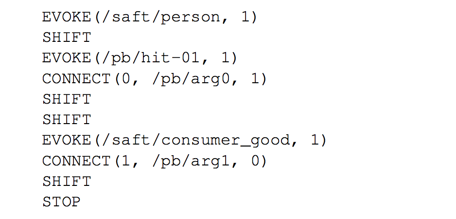

## Welcome to FrameBlends Project 

This project is developed by Wenyue Xi (Suzie) for Google Summer of Code 2020 with Red Hen Lab

### Project Description 
- For the project idea "AI Recognizers of Frame Blends, Especially in Conversations About the Future," my proposal aims to build a semantic tagging system to detect different time frames in the conversation in the form of text or video record. Ideally, this system can classify the situation where human beings imagine a future by blending the present with incompatible frames. The project will be based on some of the existed algorithms, frameworks, and databases, and also choose and integrate them carefully to accomplish the goal. If possible, this project also aims to create an interactive system that allows humans to manually mark the false positive and true negative and keep re-training the data with such manipulation by human experts. In each round of training, the system will consider the manual marks, and eventually reach the stage when the system is able to mark the desired portion as accurate as possible. When the source data is large enough, the tagging system of the blended frame also allows us to make the unnoticed connections between current and past social conditions to gain inspiration to solve the real-world problem, or provide more evidence to the anthropological and historical studies.

## Quick Index 
### Community Bonding Period 
- [Blog Report 1](#blog-report-1) (May 11 ~ May 17) 
- [Blog Report 2](#blog-report-2) (May 18 ~ May 24)
- [Blog Report 3](#blog-report-3) (May 25 ~ May 31)

## Coding Period Before the First Evaluation 
- [Blog Report 4](#blog-report-4) (Jun 1 ~ Jun 7)

## Community Bonding Period 
### Preparation Stage
- May 10: Finish general set-up process of CWRU HPC and gallina home 
- May 13: Inital project meeting with Professor Turner and other mentors 
- May 14: Inital onboarding group meeting with other 2020 GSoC members 

### Blog Report 1 

#### Part 1: Completed preparation tasks 
After the initial meeting and the group meeting, I gain a more specific sense of the plan, path, and the direction of this project, and also feel supported by a professional and welcoming community. After the meeting, I review both my notes and the video recording of my initial project meeting. I summarized the tasks and finished some part of it, while setting a clear timeline of studying, planning, and coding. 

I also reach out to the student who had worked on the FrameNet project last year(Yong Zheng Xin) from LinkedIn and got his email address. Thus, I can further email him to clarify some questions about FrameNet 1.7, Semafor and Open-Sesame in the following week. I have reached out to Professor Whitehouse and Professor Uhrig, who expressed interest in my project and proposal during the group meeting. Based on the large amount of information I have received, I list and finish some small tasks before setting a detailed plan and the general project timeline. 

The following small tasks have been completed by May 18, Monday. 

- Understand Red Hen Techne Public Site in detail 
- Understand how to create Singularity and other information related to Singularity 
- Understand Red Hen Edge Search Engine and Edge2 Search Engine in detail
(e.g., How to search for linguistic patterns) 
- Explore the data from Gallina Home, be familiar with the different file extension, especially seg file 
- Be familiar with the existed frame detecting tools, such as Semafor and Open-Sesame packages (These are the packages to decide which is the best candidate for tagging) 
- Study Berkeley FrameNet website, especially Full Text Annotation
- Begin to study the book FrameNet II: Extended Theory and Practice  
- Follow the [Semafor instruction by Dipanjan Das](https://github.com/Noahs-ARK/semafor/blob/master/training/README.md) to train FrameNet 1.5 full text annotations data 
- Read about Semantics “Semantics Boot Camp” written by Elizabeth Coppock & Lucas Champollion 
- Read about MetaNet mentioned by Professor Torrent, especially the paper “Automatic metaphor detection using constructions and frames” 
- Read about Global FrameNet mentioned by Professor Torrent, especially the paper “The Multilingual FrameNet Shared Annotation Task: a Preliminary Report” 
- Reflect on Xi Jing Ping’s One Belt One Road speech video, which combined complicated visual and text to create FrameBlends, and as a great example of multimodal communication 
- Read some important presentation and publications about multimodality, including “Tutorial on Multimodal Machine Learning” from ACL 2017, “Multimodal Machine Learning: A Survey and Taxonomy”, “Multimodal Fusion for Multimedia Analysis: A Survey”, and“Deep Multimodal Learning: A survey on recent advances and trends” 

#### Part 2: Rethinking about the goal 
After the project meeting, I reflect on Xi Jing Ping’s One Belt One Road speech as an example of multimodal communication, which requires multimodal machine learning to analyze it. I have asked the question regarding different formats of data, such as visual and text, and their collaboration mechanism as the input data of frame blends detection. I realize I asked a question about multimodal communication even before I know the definition of this concept, which is the essential part of Red Hen’s mission. Thus, I’m intensively reading important publications about multimodal communication besides semantics. Of course, I will focus more on semantics since I will begin with text right now. 

This project is challenging yet inspiring; it’s related to cognitive science and the general disciplines of humanities, and aims to offer a useful tool for human analysts. For such a complicated and large-scale project, as Professor Turner mentioned in the initial project meeting with mentors, it’s better to starts with simple and small thing that works, and then build on top of it. From the initial meeting, I summarize and break down the three main goals of functionalities in a progressing manner.

- Work with existed tools to detect frame blends, identify the flaws or the biased parts, integrate or improve them
- Build an interactive system to manually enter text and frame, allow human experts labeling 
- Detect the communication about future based on detection of frame blends 

Additionally, I have some preliminary ideas about the interactive system for manually input the text and frame in the further research steps, which need to plan a comprehensive system of rules for entering data with restriction for merging the data to the original dataset. This may also need me to gain more background knowledge about cognitive science and linguistics, especially semantics. 

However, I’m not sure which steps I can eventually accomplish during this summer, so I decide to start from the first step, “Detect frame blends.” After having enough confidence in this part, I may then begin to think about the next steps. Thus, I write the third part of this blog post to begin work on “Detect frame blends.”

#### Part 3: Next step to accomplish “Detect FrameBlends”  
After studying and making the judgment from the complicated and massive information, I realize there are a lot of skills and knowledge I do not have yet, but need to have in order to accomplish the goal of this project. Those not-yet-have but have-to-gain tasks are: 

- Confirm proper dataset for training and testing from Red Hen data source 
- Deeply understand and are able to test the existed tools for detecting FrameBlends, mainly including Semafor and Open-Sesame   
- Try to test out the bias and flaws of the existed tools and explore the underlying reasons  
- Try to improve the system based on the flaws of the existed tools, or create functional integration 
- Gain more linguistics background knowledge about Semantics and Syntax  
- Gain a solid understanding about multimodal communication and multimodal machine learning 

My tentative plan for the following week(May 18 ~ May 24) shows as following(Still updating): 

- Choose the proper dataset from The UCLA NewsScape data from the gallina directory ( /mnt/rds/redhen/gallina/tv ) on CWRU HPC
- Implement and test Semafor and Open-Sesame to the chosen dataset 
- Discuss the updated research plan and questions with mentors and others who may contribute helpful suggestions 

#### Part 4: Study materials
My study materials and important websites that may be helpful for other student who takes over this project: 

- [Semafor github page](https://github.com/Noahs-ARK/semafor)

- [SEMAFOR 1.0: A Probabilistic Frame-Semantic Parser](https://www.cs.cmu.edu/~nschneid/dscs-tr.pdf)

- [Open-Sesame github page](https://github.com/swabhs/open-sesame)

- [Frame-Semantic Parsing with Softmax-Margin Segmental RNNs
and a Syntactic Scaffold](https://arxiv.org/pdf/1706.09528.pdf)

- [FrameNet Full Text Annotation](https://framenet.icsi.berkeley.edu/fndrupal/fulltextIndex) 

- [FrameNet II: Extended Theory and Practice](https://framenet2.icsi.berkeley.edu/docs/r1.5/book.pdf)

- [Invitation to Formal Semantics(Formerly known as Semantics Boot Camp)](http://eecoppock.info/bootcamp/semantics-boot-camp.pdf)

- [The syntax of natural language:An online introduction using the Trees program](https://www.ling.upenn.edu/~beatrice/syntax-textbook/)

- [Treebanks: Building and Using Parsed Corpora](https://link.springer.com/content/pdf/10.1007%2F978-94-010-0201-1.pdf)

- [Tutorial on Multimodal Machine Learning](https://www.cs.cmu.edu/~morency/MMML-Tutorial-ACL2017.pdf)

- [Multimodal Machine Learning: A Survey and Taxonomy](https://arxiv.org/abs/1705.09406)

- [Multimodal Fusion for Multimedia Analysis: A Survey](https://link.springer.com/article/10.1007/s00530-010-0182-0)

- [Deep Multimodal Learning: A survey on recent advances and trends](https://ieeexplore.ieee.org/document/8103116)

### Blog Report 2 
#### Weekly Summary (May 18 ~ May 24) 
In this week, I begin to investigate the existing frame analysing systems, including Semafor, open-SESAME, and Sling, request and study the hand-annotation data（Full Text Annotation) from FrameNet. I also conduct a report for [reviewing the existing frame analysing tools](#reviewing-the-existing-frame-analysing-tools). On the theoretical level, I’m reflecting on the mechanism for detecting frame blends, and will discuss my questions and thoughts in the mentor meeting next week. 

The following is my daily progress report for this week (May 18 ~ May 24):  

#### Monday 
- Read Yong’s blog for last year’s FrameNet Project 
- Listen to recording for the initial project meeting
- Investigate about Open-Sesame and Semafor github repo and the corresponding paper 

#### Tuesday 
- Send email to Professor Torrent-- receive suggestion about checking Sling and Daisy 
- Send Yong an email to confirm the implementation of Semafor and Open-Sesame  
- Request FrameNet 1.7 Data 
- Study Berkeley Full Text Annotation 
- Study [Sling github repo](https://github.com/google/sling): install Sling, request and download linguistic data consortium data for Sling, train the pre-trained model  
- Read paper [Attention Is All You Need](https://arxiv.org/abs/1706.03762)  

#### Wednesday
- Attend Professor Turner’s zoom seminar 
- Receive data from FrameNet 
- Set up next week’s meeting with mentors 
- Learn to use Sling Python API, such as Frame stores, record files, parising 
- Study semantics knowledge using [Semantics Boot Camp](http://eecoppock.info/bootcamp/semantics-boot-camp.pdf) 

#### Tuesday 
- Study the implementation of  FrameNet Full Text Annotation data 
- Read paper [SLING: A framework for frame semantic parsing](https://arxiv.org/abs/1710.07032) 

#### Friday 
- Write the comparison report of Semafor, Open Sesame and Sling(tentative)
- Study the hand-annotating mechanism of [FrameNet Full Text Annotation](https://framenet.icsi.berkeley.edu/fndrupal/fulltextIndex) 
- Read [Frame-Semantic Parsing](https://www.mitpressjournals.org/doi/full/10.1162/COLI_a_00163) published by Computational Linguistics  

#### Saturday
#### Take Notes about FrameNet data, especially Full Text Annotation  
The image below is the model of FrameNet architecture: 

**Frame-to-Frame Relations** 
> With the move to a relational database, we suddenly found ourselves able to represent such frame-to- frame relations, and hence, to make lots of decisions about just what sort of frame hierarchy we wanted, and how it could best be represented. 

There are three types of defined frame-to-frame Relations: 	
- Inheritance proper: all of the types and structure of the parent frame were inherited 
- Using relation: only a subset of the parent FEs were inherited 
- Subframe: subevent of complex events, sometimes using suggestive names like “scenario” for frames with subframe structure 

**Coreness and FE-to-FE relations within a Frame** 

Three types of FE(frame element): 
- Core: core FEs are essential to the definition of the frame itself, such as the SPEAKER and ADDRESSEE in the Statement frame 
- Peripheral: Peripheral FEs are those which are inherently part of the situation, but not central to the definition of the frame.  
- Extra-thematic: Extra-thematic FEs situate an event against a backdrop of another state of affairs, either or an actual event or state of the same type or by evoking a larger frame within which the reporte state of affairs is embedded. 

Non-core types(maybe incomplete): 
- Co-participant 
- Duration
- Iteration 
- Manner 
- Means 
- Place 
- Time 
- Purpose 
- Degree 
- Frequency 

**About Full Text Annotation** 

For Full Text Annotation, every frame evoking element would be marked as a target, and that most (or all) of the rest of the text would be labeled as frame elements; an opera- tion which would compose the meanings of these labelings would produce at least a good start on a deep representation of the meaning of the text.   
				
Full Text Annotation means to annotate all the frame-evolving words in running text. This annotation method is different because: 
- Contrary to usual practice of selecting relatively short, clear sentences. Full Text Annotation have to annotate sentences that are longer and have more complex  structure. 
- Contrary to common LUs by virtue of their appearance in the text that we happen not to have covered. In long-run, this will improve FrameNet’s coverage of the general vocabulary. 

Full Text Annotation requires a major efforts to define new frames.It was  estimate that they need roughly 250 new frames to cover the first 125 sen- tences of text, which amounts to 50% increase in our total frame inventory. 
				
			
Current Full Text Annotation includes: 
- American National Corpus Texts
- AQUAINT Knowledge-Based Evaluation Texts
- LUCorpus-v0.3
- Miscellaneous
- Texts from Nuclear Threat Initiative website, created by Center for Non-Proliferation Studies
- Texts from WikiMedia--WikiNews and Wikipedia
- Wall Street Journal Texts from the PropBank Project

References: 
- [FrameNet Data Full Text Index](https://framenet.icsi.berkeley.edu/fndrupal/fulltextIndex) 
- [The Evolution of FrameNet Annotation Practices](http://lrec.elra.info/proceedings/lrec2004/ws/ws17.pdf#page=5) 

#### Sunday 
#### Reviewing The Existing Frame Analysing Tools
**Semafor** 

 
*An example sentence from the annotations released as part of FrameNet 1.5 with three targets marked in bold.* 

- Two-stage statistical model that takes lexical targets in their sentinel contexts and predicts frame-semantic structures 
- [Greedy beam search algorithm](https://towardsdatascience.com/an-intuitive-explanation-of-beam-search-9b1d744e7a0f) for argument identification that avoids illegal argument overlap 
- Error analysis pertaining to the dual decomposition argument identification algorithm
- Uses graph-based semi-supervised learning to better generalize to new predicates 

Three Subproblems: 
- Target identification: deciding which word tokens (Lexical Units) evoke frames in a given sentence
- Frame identification: given targets, the parser then identifies their frames 
- Argument identification: choosing which of each FEs(Frame Elements) roles are filled, and by which parts of sentence

There are two stages: 
- First stage: disambiguates the target in context to a semantic frame 
- Second stage: finds the target’s locally expressed semantic argument 

Dataset: 
- [SemEval 2007 structure extraction task](http://ufal.mff.cuni.cz/acl2007/archive/workshops/ws01/program.shtml)
- FrameNet 1.5 

**Issue of Semi-Supervised Lexicon Expansion**  
The poor performance of our frame identification model on targets that were unseen as LUs in FrameNet or as instances in training data, and briefly describe a technique for expanding the set of lexical units with potential semantic frames that they can associate with. 

More techniques required: 
- Latent variable modeling 
- Semi-supervised learning 
- Joint interface 

References: 
[Frame-Semantic Parsing](https://www.mitpressjournals.org/doi/pdf/10.1162/COLI_a_00163)

**Open-SESAME** 

Open-SESAME add syntax through a traditional pipeline as well as a multi-task learning approach which uses a syntactic scaffold only at training time.  They conclude that scaffolding is a cheaper alternative to syntactic features since it does not require syntactic parsing at train or at test time. 		

**This model's main contributions:**
1. Build the first syntax free frame-semantic argument identification system, introducing the softmax-margin SegRNN. The model using a similar dynamic programming algorithm as zeroth-order semi-Markov dynamic program.  
 
2. Using the basic model as a foundation to test whether incorporating syntax is still worthwhile. They find that this syntactic pipelining approach improves over both our syntax-free model and achieves state-of-the- art performance. 
- Syntactic features: Phrase-structure features,  Dependency features 
- Syntactic scaffolding: Syntactic scaffolds avoid expensive syntactic processing at run- time, only making use of a treebank during training, through a multitask objective. This method minimizes an auxiliary supervised loss function, derived from a syntactic treebank.  
			
Dataset:  
- FrameNet 1.5 
- OneNotes

References: 
- [Frame-Semantic Parsing with Softmax-Margin Segmental RNNs and a Syntactic Scaffold](https://arxiv.org/abs/1706.09528)				
				
- [Syntactic Scaffolds for Semantic Structures](https://arxiv.org/pdf/1808.10485.pdf)
 
 **SLING** 

- SLING supports general transition-based, neural-network parsing with bidirectional LSTM input encoding and a Transition Based Recurrent Unit (TBRU) for output decoding. The SLING parser exploits deep learning to by-pass those limitations of classic pipelined systems. It is a transition-based parser that outputs frame graphs directly without any intervening symbolic representation. This neural network architecture has been implemented using DRAGNN (Kong et al., 2017) and Tensor- Flow (Abadi et al., 2016). 

 
#### SLING Frame 
SLING frames live inside a frame store. A store is a container that tracks all the frames that have been allocated in the store, and serves as a memory allocation arena for them.  

#### Attention 
- The SLING parser is a kind of sequence-to- sequence model that first encodes the input text to- ken sequence with a bidirectional LSTM encoder and then runs the transition system on that encod- ing to produce a sequence of transitions. 			
- Sequence-to-sequence models often rely on an “attention” mechanism to focus the decoder on the parts of the input most relevant for producing the next output symbol. But SLING uses the different attention mechanism, which focuses on parts of the frame representation that the parser has created so far, not the input tokens as is common for other sequence-to-sequence attention mechanism. 
- Attention buffer is a ordered list of frames, and the order represents closeness ot the center of attention. The transition system maintains the attention buffer, bringing a frame to the front when the frame is evoked or re-evoked by the input text. 

#### Transition System 
The transition system simultaneously builds the frame graph and maintains the attention buffer by moving the frame involved involved in an action to the front of the attention buffer. The transition system consists of the following actions: 
- Shift 
- Evoke 
- Refer 
- Connect 
- Assign 
- Embed 
- Elaborate 
		 	 	 						
For example, the sentence “John hit the ball” generates the following transition sequence: 
 

Dataset: 
OntoNotes 

References: 
- [SLING: A framework for frame semantic parsing](https://arxiv.org/abs/1710.07032) 
- [JSON](https://www.json.org/json-en.html) 

### Blog Report 3
This week, I mainly work on discussing the theoretical plan for detecting frame blends with mentors, exploring the implementation of SLING on CWRU HPC. 

- [Suzie’s Thoughts about  Detecting Frame Blends_Presentation Slides](https://docs.google.com/presentation/d/1VhzfkSUXV7-C6Ndkds46igfntaJp04PoZ1McFF85ZDs/edit?usp=sharing)
- Mentor meeting on Wed 

#### Mentor Meeting Minutes

This section is a brief meeting minutes for today’s meeting with my own comments about further tasks. In this meeting, we mainly discuss the following issues: 

- Two methods from MetaNet : The integration of both theory driven approach and computational approach 
- The possibility of building interactive with incorporating manually marks in the future 
- Discuss the implementation and theoretical aspect of SLING, and further possibility to set up SLING pipeline at CWRU HPC 
- Introduce PathLSTM 
- About FrameNet Full Text Annotation: develop a algorithm that can detect frame blends based on the existing annotation 

My tasks to implement: 
- Look closer to the Full Text Annotation, its structure, annotation rules and data choices 
- Try to find tentative pattern of frame blends based the existing annotation of Full Text Annotation data 
- Write down pseudo code about the tentative algorithm 
- Make pseudo code into functional code
- Test them to check whether it work 
- Maybe include SLING later, and think about its implementation  

#### Notes about MetaNet

The MetaNet project mainly intends to include three parts: 

- A repositor of formalized metaphors, frames, metaphor constructions, and metaphoric relational patterns 
> Use a set of manually defined metaphoric constructional patterns to identify candidate expressions with explicitly realized potential target and source elements 

- An automated metaphor extraction system that utilizes information form the repo to identify expressions of metaphor in text and annotate them with semantic info 
> Match the manually defined, constructional patterns with the actual corpus to detect metaphor   

- Computational tools to evaluate, analyze, and visualize the extracted metaphor data 

The three steps **”Metaphor construction → Metaphor extraction → Match construction patterns”** compose the iterative analysis process in the MetaNet model. 

For the purely empirical, computational and  corpus-based method, instead of relying on intuitions about how a given target domain is metaphorically conceptualized, MetaNet explores the possibility to search a corpus and identify which source domain lemmas and frames are used, and with what relative frequency. 
			
It also points out the importance of frame-to-frame relation, because frame-frame relations define how one frame incorporates the semantics of another, metaphor-metaphor relations define the hierarchy of metaphors. 

Example: 
 

References: 
[MetaNet: Deep semantic automatic metaphor analysis](https://www.aclweb.org/anthology/W15-1405.pdf) 

#### Additional Background Reading 
- [Words and Rules: The Ingredients of Language](https://monoskop.org/images/9/9e/Pinker_Steven_Words_and_rules_the_ingredients_of_language_1999.Pdf)

- [Speech and Language Processing](https://web.stanford.edu/~jurafsky/slp3/ed3book.pdf) 

## Coding Period Before the First Evaluation 
### Blog Report 4 
- The big day is finally here:)  
- Preparation summary before June 1

Before the official coding period, I mainly finished the following preparation works. 
1. Gain a basic understanding of the data structure and annotation rules of FrameNet Full Text Annotation 
2. Gain a basic understanding of the existing parsers, including Semafor, Open Sesame, and SLING 
3. Gain a basic understanding of multimodal communication and multimodal machine learning 
4. Make progress of understanding the general linguistics and semantics knowledge 
5. Understand the MetaNet model 
6. Gain some background knowledge on Natural Language Processing(NLP) 
7, Reach out mentors to discuss progress and further steps
8. Carefully document my progress and used materials for the benefits of future members 

Some thoughts: 

I don’t need to focus on the general theory for detecting the frame blends, instead, I should start with actual text and annotation. Even if the algorithm may only apply for one article at first, then the second article, then the third article...after such an iterative process,the algorithm maybe work to some extent. It’s important to find what pattern may be effective to a limited extent, and then increase this extent. At beginning, this task will be solely based on small dataset, depends on the existing annotation of some specific articles of FrameNet full text annotation. 

1. Begin with American National Corpus Texts 
2. Start with data-oriented methods 
3. Work ased on the understanding about FrameNet structure and methods(according to the book  FrameNet II: Extended Theory and Practice), especially how this full text annotation has been developed 
4. Start with pseudo code to describe the noticed patterns 

#### Daily Plan and Progress 
#### Monday 
- Understanding xml dataset corresponding to the reader-friendly annotated text on the FrameNet website, and write a documentation explaining the xml data 
[The link to Example of FrameNet Full Text Annotation XML data(with my annotation)](https://docs.google.com/document/d/17ET_VqXSuv0cA3Fhl2jCw6--xHbC2_WXOLEcfdXdfb8/edit?usp=sharing) 

- Explore metaphor frame-to-frame relation and metaphor labels in the Sentence layer

#### Tuesday
- If possible, generate some pseudo code statement 

#### Wednesday
- Mentor meeting 

#### Thursday 

#### Friday 

